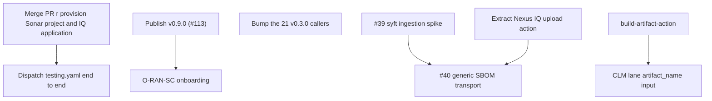

<!--
SPDX-License-Identifier: Apache-2.0
SPDX-FileCopyrightText: 2026 The Linux Foundation
-->

<!-- markdownlint-disable MD013 -->

# Interim Evaluation: Security Workflows Development Cycle

Dated 2026-09-23. A break-point review of `security-workflows` against
`docs/BRIEF.md`, taken after the merge of PR #113, with v0.8.0 the
latest published release. It records what this cycle delivered against
the plan the previous revision of this document set out on
2026-08-19 (after PR #38, v0.3.0), what that plan got wrong, what the
estate adoption survey found, and the work that remains before the
repository can be called done for ONAP, O-RAN-SC and OpenDaylight.

## Where we are

All seven lanes from the BRIEF's inventory are ported and shipping:
`sonatype-lifecycle`, `sonarqube-cloud`, `zizmor`, `openssf-scorecard`,
`package-hardening-audit`, `codeql` and `action-pin-audit`, each with
GitHub and (where the posture allows) Gerrit examples.

Between v0.3.0 and v0.8.0 the cycle closed **17 issues** across ten
releases. Of the seven open when the previous revision was
written, five are closed. Two — #39 and #40, the SBOM transport — remain,
still blocked on the same empirical question. One new issue, #74, is open
with its fix in review (PR #114).

The two scan lanes gained, in outline:

- **CLM lane:** `go.list` as the default Go scan target (D23), a
  `python` `build_type` (D24), toolchain selection from `go.mod`
  (D21), `fetch_depth` and `submodules` checkout inputs, and
  `mvn_pom_file`.
- **Sonar lane:** aggregate JaCoCo coverage handed to the scanner
  (D22), `scanner_args` exposed as a lane output, `prescan_script_path`
  for a checked-in pre-scan script, and `mvn_pom_file`.
- **Both:** the migration-audit input regressions settled (#58–#61),
  with evidence of what callers actually set recorded in the BRIEF.

Self-testing changed shape. `tests/workflow-steps.sh` runs on every
pull request via `workflow-tests.yaml`, extracting the lanes'
validation and hook steps verbatim with `yq` and executing them against
generated inputs — 69 cases on `main`, with mutation testing used to
prove each check can fail. That was a response to a finding covered
below: `testing.yaml` itself is dispatch-only and has barely run.

## Adoption

The previous revision sequenced deployment as ONAP first, then
O-RAN-SC and OpenDaylight after the ONAP wave. Adoption overtook that
plan. A GitHub code search on 2026-09-23 finds **55 repositories**
outside this organisation calling the lanes, from 60 workflow files:

| Org          | Lane                 | Repositories |
| ------------ | -------------------- | ------------ |
| ONAP         | `sonatype-lifecycle` | 39           |
| ONAP         | `sonarqube-cloud`    | 3            |
| ONAP         | `openssf-scorecard`  | 2            |
| OpenDaylight | `sonarqube-cloud`    | 16           |
| O-RAN-SC     | —                    | 0            |

OpenDaylight onboarded its Sonar estate in parallel with ONAP rather
than after it. O-RAN-SC has not started.

The pins are spread across six releases, and the oldest is the largest
group:

| Pinned release | Calls |
| -------------- | ----- |
| v0.3.0         | 21    |
| v0.5.0         | 4     |
| v0.5.2         | 1     |
| v0.6.1         | 4     |
| v0.7.0         | 28    |
| v0.8.0         | 3     |

**21 calls are still pinned to v0.3.0**, the release the previous
revision reviewed. Those callers run without everything this cycle
fixed, including D21's toolchain correction. Pinning is correct and
deliberate (D7); what it needs is Dependabot, or a coordinated bump,
reaching them. That is rollout work in the consuming repositories, not
here, but it is the largest gap between what this repository ships and
what the estate runs.

## Progress against the previous plan

### What closed

<!-- markdownlint-disable MD013 -->

| Issue    | Outcome                                                                                                                              | Delivered by                        |
| -------- | ------------------------------------------------------------------------------------------------------------------------------------ | ----------------------------------- |
| #41      | `go_scan_target`, default `go.list`; `'sum'` kept for parity (D23)                                                                   | PR #90                              |
| #42      | `build_type: 'python'` resolving `requirements.txt`, `uv.lock` or project metadata (D24)                                             | PR #113 (unreleased; see below)     |
| #43      | **Closed the opposite way** — build metadata is not used for Go; the CLM lane now reads `go.mod`, as the Sonar lane always did (D21) | PR #76                              |
| #44      | BRIEF's Node.js CLM claim corrected                                                                                                  | PR #73                              |
| #50      | Gerrit example gains the Go variant; `policy-opa-pdp` cut over with `scan_mode: 'sbom'` pinned                                       | PR #90; ONAP                        |
| #54      | Workspace variables in Maven parameters expanded                                                                                     | `maven-build-action`                |
| #55, #56 | Multi-module JaCoCo coverage                                                                                                         | `maven-build-action` v0.4.0; PR #53 |
| #57      | CLM lane accepts `fetch_depth` and `submodules`                                                                                      | PR #73                              |
| #58      | `prescan_script_path`, containment-checked against the checkout                                                                      | PR #99                              |
| #59, #60 | `ENV_VARS`/`ENV_SECRETS` and `op_secret_reference` **stay dropped**, on evidence; design recorded                                    | PR #99                              |
| #61      | `mvn_pom_file` on both lanes                                                                                                         | PR #99                              |
| #70      | `coverage_report_paths` wired into the Sonar scan (D22)                                                                              | PR #76                              |
| #75      | Go fixture gains a `toolchain` directive; assertion asserts on it                                                                    | `test-go-project`; PR #82           |
| #77      | CLI-mode coverage self-test able to fail                                                                                             | PR #89                              |
| #100     | Per-PR harness for the lanes' validation and hook steps                                                                              | PR #113                             |

<!-- markdownlint-enable MD013 -->

### Where the plan was wrong

Four outcomes departed from what the previous revision predicted, and
each is worth knowing before trusting the rest of this document's
forecasts.

**#43 was reversed, not completed.** The plan proposed extending
`build-metadata-action`'s Go version detection to the Sonar lane for
consistency. Investigation found the CLM lane's use of it was itself a
defect: its `go_go_version` output is the `go` directive alone, and
passing it to `setup-go` as `go-version` suppressed the `toolchain`
directive, silently building on a Go the project had moved away from.
The CLM lane now reads `go.mod` through `go-version-file`; the Sonar
lane always had, through `go-test-action`, and was never affected.
Following the plan would have spread the defect to it. D21 records it.

**#41 was not blocked for long.** Its sequencing behind the
`policy-opa-pdp` cutover assumed the cutover was pending. It had
already happened, with `scan_mode: 'sbom'` pinned — the REST path, which
never reads the CLI's scan target — so the default flip could not
disturb its comparison. Both #41 and #50 closed together in PR #90.

**#59 and #60 closed as decisions, not features.** The migration
audit found no caller setting `ENV_SECRETS` and none setting
`OP_SECRET_REFERENCE`, and the `ENV_VARS` values in use were either
already served by typed inputs or inert. The BRIEF's "Dropped inputs"
section records the evidence and the design to build if a consumer
appears. #60 reversed an earlier recommendation to keep it open.

**#42's "identify consumers first" gate passed.** The previous
revision expected Python CLI demand to be unproven. Three O-RAN-SC
projects — `pti-o2`, `smo-ves` and `ric-plt-xapp-frame-py` — still run
the legacy `gerrit-tox-nexus-iq-clm` job, so the CLI path was built
rather than closed as covered by SBOM mode. `pti-o2` pins two of its
eighteen requirement lines exactly, so a manifest scan would evaluate
two components where resolution yields 56.

## Course check against the BRIEF

The BRIEF's strategy still holds: nothing argues for revisiting the
repository split, the lane inventory, or the `build_type` collapse.
The previous revision raised two course corrections. Neither was acted
on, and one got worse.

**1. Inline shell in the CLM lane grew rather than shrank.** The
previous revision counted ~50 lines of SBOM generation and Nexus IQ
REST upload shell and called for extraction. Since then the lane's
`run:` blocks went from 127 lines across 9 steps (v0.3.0) to 323 lines
across 15, and the file from 769 to 1,184 lines. Much of the growth is
justified validation — the checks the per-PR harness now tests — and
the Python resolution step, but the REST upload the previous revision
singled out is still inline, and no extraction has started. The
per-PR harness makes an extraction safer than it was: every step it
covers would need moving with its cases.

**2. The build↔scan interface is still the structural gap.** No
`build-artifact-action` exists. Each `build_type` still rebuilds the
project inside the scan job, and this cycle added one more
(`python`). The design below is unchanged and still unstarted.

## Open issue inventory

Three issues are open.

<!-- markdownlint-disable MD013 -->

| #   | Title (abbreviated)                       | State                                                                           |
| --- | ----------------------------------------- | ------------------------------------------------------------------------------- |
| #74 | No submodule-bearing fixture              | Fixed in PR #114 (in review); needs server provisioning before it can pass      |
| #39 | Verify Nexus IQ ingestion of syft SBOMs   | Unstarted. Needs uploads to the live Nexus IQ server, which requires a decision |
| #40 | Generalise the SBOM upload path beyond Go | Blocked on #39. The naming half and the validation trap were absorbed by PR #38 |

<!-- markdownlint-enable MD013 -->

### #74 — submodule scanning (PR #114)

`lfreleng-actions/test-python-submodules` now exists: three nested
levels in one repository on one branch, each submodule pinning an
earlier commit of the same `main`, each level carrying a distinct
package pin and marker file. PR #114 scans it through both lanes with
`submodules: 'recursive'` and, as a negative control, `'true'`, then
queries Nexus IQ and SonarCloud for which levels reached the result.
Results are attributed to their own scan by the server's record, not
the runner's clock. Its dependencies are listed under the immediate
work below.

### Cluster A — SBOM transport generalisation (#39 → #40)

Unchanged in substance. The whole generalisation rests on whether
Nexus IQ identifies components from a syft-generated CycloneDX
document as well as from `cyclonedx-gomod` output. That is a
comparison against live Nexus IQ, and nothing in Cluster A should be
built until it lands.

Two facts moved:

- **`sbom-action` is now v0.1.0** and has a second backend,
  `cyclonedx` — but it drives the CycloneDX Maven and Gradle plugins,
  for Java, where syft cannot see the resolved graph. A
  `cyclonedx-gomod` backend is still listed as future. So the
  previous revision's risk still stands exactly: a negative #39 result
  means implementing that backend in `sbom-action` before Go can move.
- **The Python half is no longer SBOM-only.** #42 delivered a CLI path
  for Python, so SBOM mode for Python is a second route rather than
  the only one. The generator-selection rules in Phase 2 below still
  apply for `build_type: 'none'`.

## Remaining work

### Immediate — prove what already shipped

This is the most important section of the document. The credentialled
self-test has not verified the lanes it covers.

1. **Dispatch `testing.yaml` and make it pass.** It has run six times
   ever, all on 2026-07-28, before it became dispatch-only. The
   fixture applications on the Nexus IQ server show why: the Go and
   Python applications hold **zero** reports, and the Maven and Node
   applications do not exist. So none of its credentialled legs —
   including every assertion added this cycle — has completed a scan
   in its current form. The per-PR harness proves the lanes' logic;
   only a dispatch proves they reach the servers. The workflow now
   runs one at a time across all refs and never cancels mid-flight,
   because every leg scans into server-side projects shared by every
   run.
2. **Merge PR #114**, after provisioning what it needs: a SonarCloud
   project `lfreleng-actions_test-python-submodules` and a Nexus IQ
   application `lfreleng-actions-test-python-submodules`. The fixture's
   own Sonar key correction (`test-python-submodules#1`) is worth
   merging but no longer blocks it, because the legs name the project
   explicitly.
3. **Settle the Nexus IQ credential.** Locally, the IQ username returns
   HTTP 401 and only the user code authenticates. CI's
   `NEXUS_IQ_USERNAME` matches neither local identity, so it is likely
   a separate service account, and only a dispatch will show whether
   it authenticates. If it does not, every CLM leg fails at the first
   request.
4. **Publish v0.9.0.** PR #113 — the `python` `build_type` and the
   per-PR harness — is merged but unreleased, waiting in the v0.9.0
   draft. The three O-RAN-SC Python consumers cannot pin it until it
   is tagged.

### Rollout

1. **Bring the 21 v0.3.0 callers forward.** They miss D21's toolchain
   fix among everything else. Dependabot should raise these; if it is
   not configured in the consuming repositories, a coordinated bump is
   needed.
2. **O-RAN-SC onboarding**, the one estate that has not started. The
   three Python CLM projects are the first candidates once v0.9.0 is
   tagged; they will need `python_version`, since two resolve only
   under Python 3.11 (D24). Its two Sonar pre-scan jobs point
   `PRE_BUILD_SCRIPT_URL` at the `master` branch of `ci-management` —
   a mutable ref — and `prescan_script_path` exists to replace exactly
   that.
3. **Deprecate `lfit/releng-reusable-workflows`** once the ONAP and
   O-RAN-SC waves complete (BRIEF follow-up 5). OpenDaylight's Sonar
   jobs have already moved.

### Phase 2 — consolidate the SBOM transport (#40)

Sequenced after the #39 verdict, and unchanged from the previous
revision except where the facts moved:

1. Extract the REST upload into a composite action
   (`nexus-iq-sbom-upload-action` preferred; extending
   `sonatype-lifecycle-scan-action` acceptable if a single Nexus IQ
   surface is judged more valuable). Follow `grype-scan-action`'s
   `scripts/*.py` pattern for the UUID lookup and POST. This step does
   not depend on #39 and can start now; it is also the extraction the
   course check above calls for.
2. Replace the in-lane `cyclonedx-gomod` install with `sbom-action`
   (backend per #39's verdict), retiring `go_sbom_tool_version`.
3. Open `scan_mode: 'sbom'` to every shipped `build_type`, removing the
   Go-only guard. Generator selection takes a strict precedence: an
   explicit `sbom_generator` override wins; otherwise a non-`none`
   `build_type` names its own generator — `maven` and `gradle` map to
   `sbom-action` (whose `cyclonedx` backend now exists for them), `go`
   to `sbom-action`, and `python` to `python-sbom-action`; for
   `build_type: 'none'` the lane detects Python from
   `python-sbom-action`'s supported manifests (`pyproject.toml`,
   `setup.py`/`setup.cfg`, `requirements.txt`, `Pipfile.lock`,
   `poetry.lock`) rather than from `build-metadata-action`'s
   `project_type` alone, which misses a `requirements.txt`-only
   project. Whatever detection step feeds this must run for
   `build_type: 'none'` with `scan_mode: 'sbom'`, or the selection
   input arrives empty exactly where it decides.
4. Update D20: the lane has an ecosystem-agnostic SBOM transport, of
   which Go was the first consumer; record the #39 finding, dated.
5. Record the conscious decision to depend on a v0.x action from a
   security lane.

Self-test additions: `sbom`-mode legs for at least one JVM fixture
and `test-python-project`.

### Phase 3 — new ecosystems

1. **Node.js** — no issue; `onap/portal-ng-ui` already runs the CLM
   lane with no pre-scan build. File one only if a consumer needs more.
   SBOM mode from Phase 2 is the default answer; `node-build-action`'s
   `node_modules` makes a CLI path cheap if fidelity demands it.

### Phase 4 — strategic: the build↔scan artefact interface

Unstarted, and still the largest structural improvement available.

1. Create `build-artifact-action` (pack/unpack) per the design below,
   in its own repository, from `actions-template`, lifting
   `docker-save-images-action` v0.2.0's validation blocks.
2. Add an optional `artifact_name` consumption path to
   `sonatype-lifecycle.yaml`, with a caller example showing a producer
   job composed with the CLM lane. The artifact branch must skip both
   checkout paths and restore into a fresh, dedicated extraction root
   (not `path_prefix` itself, which defaults to the workspace root).
   `validate` rejects `artifact_name` combined with a non-`none`
   `build_type`, since `build_type` defaults to `'none'` and strict
   mutual exclusion would break every caller omitting it.
3. Add an opt-in "publish packed workspace" step to the `*-workflows`
   build lanes, so their reusable build workflows can act as producers.
4. Adopt in the `sbom-files` hops across the `*-workflows`
   repositories opportunistically.

Phase 4 can start in parallel with Phase 2 — the write scopes are
disjoint — but its `security-workflows` integration should land after
Phase 2, so the lane's input surface changes once rather than twice.
The action must land before its CLM integration: the CLM job holds
Nexus IQ credentials and would accept another job's artifact, so
prototyping unpack there with a raw `tar` extraction would expose the
traversal surface the design exists to close.

### Outside this repository

- **`test-python-project`'s Sonar key is stale.** Its
  `sonar-project.properties` names `test-python-project`, but
  SonarCloud names auto-created projects `<organization>_<repository>`,
  and knows it only as `lfreleng-actions_test-python-project`. The
  same mistake was copied into `test-python-submodules` and corrected
  there.

## Estate research findings

### Sibling action versions

| Action                           | Previous revision | Now    |
| -------------------------------- | ----------------- | ------ |
| `sbom-action`                    | v0.0.2            | v0.1.0 |
| `python-sbom-action`             | v0.1.2            | v0.1.2 |
| `grype-scan-action`              | v0.0.1            | v0.1.0 |
| `docker-save-images-action`      | v0.2.0            | v0.2.0 |
| `build-metadata-action`          | v0.8.0            | v0.8.2 |
| `sonatype-lifecycle-scan-action` | —                 | v0.2.2 |

Neither `build-artifact-action` nor `nexus-iq-sbom-upload-action`
exists.

### `sbom-action` and `python-sbom-action`

`sbom-action` is a facade over pluggable backends. `syft` performs
static analysis of lockfiles and filesystem content, covering Go,
Node.js, containers and binaries. `cyclonedx`, new since the previous
revision, drives the CycloneDX project's own build-tool plugins —
today `cyclonedx-maven-plugin`, with the Gradle plugin to join it —
because for Java the file syft reads is an input to dependency
resolution rather than its product. `cyclonedx-npm`, `cyclonedx-gomod`
and an environment-based Python backend remain planned.
`python-sbom-action` mirrors the interface and adds
`dependency_manager` detection (uv/pdm/poetry/pipenv/pip). Both emit
CycloneDX JSON and XML at caller-set spec versions and paths, and
neither uploads anywhere itself.

### The Nexus IQ REST upload belongs in a composite action

The UUID-lookup-and-POST shell in `sonatype-lifecycle.yaml` is
ecosystem-agnostic and will be needed by every `sbom` consumer. Two
placements are viable: extend `sonatype-lifecycle-scan-action` with an
`sbom_file` input, or create a small `nexus-iq-sbom-upload-action`.
The second fits the estate's single-responsibility pattern better and
keeps the CLI action's input surface honest, since none of its `iq_*`
gating inputs apply to an asynchronous upload.

### `build-metadata-action` is deliberately not used for Go

It emits `java_version`, Go versions and matrices,
`python_build_version`/`python_matrix_json`,
`javascript_requires_node`, and `project_type`/`build_tool`. Both lanes
use it for the JDK. For Go they deliberately do not: its
`go_go_version` output is the `go` directive alone, and D21 records
why passing it to `setup-go` was a defect. It also detects the JDK by
reading `pom.xml`, which is why `mvn_pom_file` with a non-default name
requires an explicit `java_version`.

### Artefact transport: the gap and the model

No estate action packages generic build output into an archive and
attaches it to a run; the `*-workflows` repositories hand-roll raw
`actions/upload-artifact`/`download-artifact` pairs.

`docker-save-images-action` v0.2.0 is the model for the pack half:
`mode: 'single' | 'per-image'`, `artifact-name`, `output-directory`,
`retention-days`, `overwrite` and `fail-on-empty` inputs; outputs for
the archive count, directory and paths; and hardened validation worth
lifting verbatim — strict booleans, allowlisted artifact names and
output paths, symlink-aware workspace containment checked before and
after `mkdir`, refusal to write through symlinks, collision detection
on slugged filenames, and uploading an explicit written-paths list so
pre-existing files are never swept in. It still lacks the
download/load counterpart.

**Proposal: `build-artifact-action`**, one composite action with
`mode: pack | unpack`, following `actions-template` conventions:

- **pack:** `paths`, `path_prefix`, a required `artifact-name`,
  `retention-days` (default 1), `fail-on-empty` (default `true`) and
  `overwrite`; tar-based so permissions and symlinks survive the
  artifact zip envelope. Pack adds **source containment** — every
  matched path, and every symlink target it resolves through, must sit
  inside `path_prefix` before the tar is written — and guards
  **credential leakage**, excluding `.git/` by default, because
  `actions/checkout` persists its token until post-job cleanup unless
  `persist-credentials: false` is set.
- **unpack:** `artifact-name` and a destination `path`, with **safe
  extraction**: entries with absolute or parent-traversal paths, and
  link targets resolving outside the destination, fail the step; and
  because member checks alone do not stop `tar` following a link
  already present below the destination, the extraction root must be
  newly created and empty. Pattern-based fan-in is out of v0.1 scope,
  since `download-artifact` is last-writer-wins for duplicate
  filenames under `merge-multiple: true`. Scope is same-run hand-offs
  only.

Docker image archives are not a consumer: they must stay intact and be
imported with `docker load`, which belongs beside
`docker-save-images-action`.

### `grype-scan-action` validates the scoping rule

`grype-scan-action` (now v0.1.0) replaces duplicated Grype shell
across the `*-workflows` families with a composite that scans SBOM
files or a Grype target reference, including `docker-archive:`. It
confirms rather than changes the BRIEF's scoping rule: SBOM and Grype
jobs stay in the `*-workflows` verify lanes, and no new lane belongs
here. Its `scripts/*.py` layout — logic too complex for bash in a
typed helper invoked from a thin step — is the template for the Nexus
IQ upload extraction, and PR #114 follows it for this repository's own
submodule assertion (`tests/scan_contents.py`). Reuse across action
repositories is by borrowing idioms, not shared code.

## Risks and open decisions

- **The credentialled self-test is unproven.** Every assertion added
  this cycle against a live server — the Go toolchain check, coverage
  forwarding, the submodule legs — has only ever been exercised
  offline or not at all. Until `testing.yaml` passes end to end, the
  lanes' behaviour against Nexus IQ and SonarCloud is inferred, not
  observed. This is the highest-priority item in the document.
- **#39 needs a decision to proceed.** It requires uploading SBOMs to
  the shared Nexus IQ server, creating applications and reports there.
  That is a side effect on shared infrastructure, so it waits on an
  owner's approval and a choice of application IDs.
- **A negative #39 result has a known cost.** `sbom-action` has no
  `cyclonedx-gomod` backend yet, so Go would need one implemented
  before moving off the in-lane generator.
- **Pin drift in the estate.** A security fix released here reaches
  only the callers that bump. With 21 calls on v0.3.0, the effective
  security posture of the estate lags the repository by a cycle.
- **Inline shell keeps growing.** Each new capability has added to
  `sonatype-lifecycle.yaml`. The per-PR harness contains the risk but
  not the size; the Nexus IQ upload extraction is the natural first
  cut.
- **Dependency on v0.x sibling actions.** `sbom-action` (v0.1.0) and
  `grype-scan-action` (v0.1.0) are young. Borrow their idioms; do not
  couple to unreleased pins; re-check each interface before Phase 2 and
  Phase 4 review.
