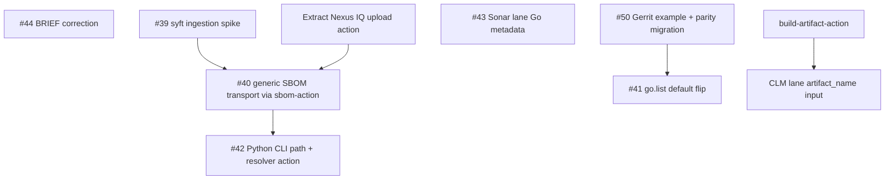

<!--
SPDX-License-Identifier: Apache-2.0
SPDX-FileCopyrightText: 2026 The Linux Foundation
-->

<!-- markdownlint-disable MD013 -->

# Interim Evaluation: Security Workflows Development Cycle

Dated 2026-08-19. This document is a break-point review of
`security-workflows` against `docs/BRIEF.md`, taken after the merge of
PR #38 (Go `build_type` for the Sonatype Lifecycle lane, tagged
v0.3.0). It inventories the open issues, records what the estate
research found, and sets out a refreshed, sequenced development plan
covering the remaining work needed before deployment to ONAP,
O-RAN-SC and OpenDaylight.

## Where we are

All seven lanes from the BRIEF's inventory are ported and shipping:
`sonatype-lifecycle`, `sonarqube-cloud`, `zizmor`, `openssf-scorecard`,
`package-hardening-audit`, `codeql` and `action-pin-audit`, each with
GitHub and (where the posture allows) Gerrit examples, and a
`testing.yaml` self-test wired to real fixtures by local path.

PR #38 (merged 2026-08-18) added `build_type: 'go'` to the CLM lane
with two transports:

- `scan_mode: 'cli'` (default) — `go mod tidy`, then the Nexus IQ CLI
  scans `go.sum`
- `scan_mode: 'sbom'` — `cyclonedx-gomod` generates a CycloneDX 1.5
  document, uploaded via the Nexus IQ REST API
  (`/api/v2/scan/applications/{uuid}/sources/cyclonedx`)

Two proposals from the review cycle were absorbed **before** merge, so
the open issues overstate the remaining work:

- The transport input landed as ecosystem-agnostic `scan_mode`, not
  `go_scan_mode` — the naming half of #40 is done.
- The CLM lane's Go toolchain version comes from
  `build-metadata-action` (`go_go_version` output), with no bespoke
  `go_version`/`go_version_file` inputs — the CLM half of #43 is done.

## Course check against the BRIEF

The BRIEF's strategy holds. Nothing found in this review argues for
abandoning the repository split, the lane inventory, or the
`build_type` collapse. Two course corrections are warranted, both in
line with the organisation's modularity priority rather than against
the BRIEF:

**1. Inline shell is accumulating in the CLM lane.** PR #38 added two
substantial `run:` blocks to `sonatype-lifecycle.yaml`: SBOM
generation via `go install cyclonedx-gomod@…` (~15 lines) and the
Nexus IQ REST upload — UUID lookup, curl-config credential handling,
POST (~35 lines). Both are exactly the "large chunks of code in
workflows" the estate design avoids, and both duplicate capability
that exists or belongs in composite actions. The BRIEF's own
convention is that workflows hold input aggregation, flow control and
action calls. The fix is extraction, tracked below.

**2. The build↔scan interface is the structural gap.** Every
`build_type` in both scan lanes re-implements "build the project" in
the scan job, because there is no estate primitive for handing build
artefacts between jobs within a workflow run. The `composed-tox` legacy
defect the BRIEF records ("the report existed on a runner the scanner
never saw") is the canonical symptom. A generic artefact
pack/attach/unpack action — modelled on `docker-save-images-action`'s
single-archive mode — would let scan lanes consume the output of the
established `*-build-action`s and `*-workflows` instead of embedding
parallel build paths that will drift. This is new scope, proposed
below as the estate-level strategic investment of this cycle.

## Open issue inventory

Seven issues are open. Status reflects the post-#38 comments on each.

<!-- markdownlint-disable MD013 -->

| #   | Title (abbreviated)                              | Remaining scope after #38                                                                                 | Cluster |
| --- | ------------------------------------------------ | --------------------------------------------------------------------------------------------------------- | ------- |
| #39 | Verify Nexus IQ ingestion of syft SBOMs          | Full — empirical spike, unblocks #40                                                                      | A       |
| #40 | Generalise the SBOM upload path                  | Partial — swap in `sbom-action`, extend beyond Go, retire `go_sbom_tool_version`                          | A       |
| #42 | Python `build_type` for the CLM lane             | Full — CLI path with dependency resolution                                                                | A       |
| #41 | Adopt `go.list` as the Go scan target            | Full — sequenced after #50's cutover                                                                      | B       |
| #50 | Gerrit example + `policy-opa-pdp` migration      | Full — the active customer driver                                                                         | B       |
| #43 | `build-metadata-action` for Go version detection | Partial — `sonarqube-cloud.yaml` only                                                                     | C       |
| #44 | Correct the Node.js CLM claim in BRIEF.md        | Full — docs only                                                                                          | C       |

<!-- markdownlint-enable MD013 -->

### Cluster A — SBOM transport generalisation (#39 → #40 → #42-sbom)

These share one goal: make `scan_mode: 'sbom'` work for every
ecosystem through one generator interface, with no per-ecosystem
branching in the lane.

- **#39 blocks #40.** The whole generalisation rests on whether Nexus
  IQ identifies components from syft-generated CycloneDX as well as
  from `cyclonedx-gomod` output. This is a comparison spike against
  live Nexus IQ, not a code change, and nothing in Cluster A should
  be built until it lands. Even a negative result does not kill the
  shape: `sbom-action` declares a `backend` input anticipating a
  `cyclonedx-gomod` backend, so the generic interface survives with a
  non-default backend for Go.
- **#40 delivers the mechanism.** Research confirms `sbom-action` is
  fit for purpose today: syft backend, CycloneDX JSON and/or XML,
  `sbom_spec_version` defaulting to 1.5 (what the lane hardcodes),
  caller-controlled output path, and `sbom_json_path`/`sbom_xml_path`
  outputs ready for a POST step. It is already consumed at the same
  pin by `go-workflows`, `node-workflows` and `java-workflows`.
  Python routes through the interface-compatible
  `python-sbom-action`, already consumed by `python-workflows`.
- **#42's SBOM half becomes cheap** once #40 lands — but not free:
  `python-sbom-action` is a distinct `uses:` target, so the lane must
  select a generator per ecosystem. Since `build_type: 'python'` does
  not exist until the Phase 3 CLI work, that selection cannot hang
  off `build_type`; derive it instead (see Phase 2). The
  higher-fidelity CLI path is separate (Phase 3).

One item in #40's status comment — the `scan_mode: 'sbom'` plus
non-Go `build_type` validation trap — was **fixed in PR #38's final
form**: the shipped `validate` job rejects the combination loudly,
with an in-file note to remove the restriction once #40 generalises
`sbom` beyond Go. Recorded here as done; no Phase 1 work remains for
it.

### Cluster B — ONAP Go migration (#50 → #41)

Sequencing was agreed on PR #38's review and must not be reordered:

1. **#50 first.** `policy-opa-pdp`'s caller pins
   `build_type: 'go'`, `scan_mode: 'sbom'` explicitly (parity with
   its Jenkins `nexus-iq-use-cli: false` history), so the cutover
   comparison against the last Jenkins runs is clean. The Gerrit
   example — the artefact ONAP projects actually copy — gains a Go
   variant with the parity note. This fails silently today: a caller
   omitting `scan_mode` gets `cli`, quietly invalidating the
   comparison.
2. **#41 second.** After cutover is confirmed, the CLI path gains
   `go_scan_target: 'list' | 'sum'` defaulting to `go.list` per
   current Sonatype guidance, with `go.sum` retained for parity
   callers. Implementation notes are settled in the issue comment:
   assert-non-empty next to generation, no `continue-on-error`,
   `go mod tidy` scoped away from the `list` path, heredoc for the
   `go list` template.

### Cluster C — consistency and documentation (#43, #44)

Small, independent, no blockers; suitable for immediate pickup or as
warm-up alongside Cluster A's spike.

- **#43 (remaining half):** `sonarqube-cloud.yaml`'s Go path still
  carries `go_version`/`go_version_file` and reads `go.mod`
  independently. Those inputs have shipped, so the change is
  deprecate-and-default with precedence preserved: explicit
  `go_version` wins, then a **non-default** `go_version_file`
  (a caller pointing at a different file must not have metadata
  silently override it), then `build-metadata-action` fills when
  both are defaults — mirroring `java_version`. Removal can ride
  the next minor bump under pre-1.0 versioning.
- **#44:** correct the Node.js CLM caller claim in the BRIEF's
  cohesion paragraph (the cited workflows do not exist at HEAD;
  `releng-reusable-workflows` carries only
  `composed-maven-nexus-iq.yaml` and `composed-gradle-nexus-iq.yaml`)
  and name the two Nexus IQ wrappers in D1 and the Lane Inventory so
  the claim is checkable. The conclusion stands on the
  language-agnostic lanes and the Go/Python trajectory.

## Estate research findings

Findings that shape the plan, from a survey of the supporting action
repositories.

### `sbom-action` and `python-sbom-action` are ready interfaces, early pins

`sbom-action` (v0.0.2) validates only the `syft` backend today;
`cyclonedx-npm`, `cyclonedx-gomod` and an environment-based Python
backend are documented as planned behind the same `backend` input.
`python-sbom-action` (v0.1.2) deliberately mirrors its interface and
adds `dependency_manager` detection (uv/pdm/poetry/pipenv/pip). Both
emit CycloneDX JSON and XML at caller-set spec versions with
caller-set paths — everything the Nexus IQ upload needs. Neither
uploads anywhere itself; consumers attach the files as workflow
artifacts (`sbom-files`, 45-day retention) for the downstream Grype
job. Depending on a v0.0.x action from a security lane is a conscious
decision #40 already flags; the mitigation is the SHA pin plus the
self-test matrix.

### The Nexus IQ REST upload belongs in a composite action

The UUID-lookup-and-POST shell in `sonatype-lifecycle.yaml` is
ecosystem-agnostic and will be needed by every `sbom` consumer. Two
placements are viable:

1. **Extend `sonatype-lifecycle-scan-action`** with an
   `sbom_file` input that switches it from CLI invocation to REST
   upload. Keeps one action as the single Nexus IQ interface.
2. **A new small `nexus-iq-sbom-upload-action`.** Keeps the scan
   action a pure CLI wrapper; the lane composes generator + uploader.

Option 2 fits the estate's single-responsibility pattern better and
keeps the CLI action's input surface honest (none of its `iq_*`
gating inputs apply to an asynchronous upload). Either way, the shell
leaves the workflow.

### `build-metadata-action` covers more than the lanes use

v0.8.0 emits, per ecosystem: `java_version`, single `go_go_version`
plus matrices, `python_build_version`/`python_matrix_json`,
`javascript_requires_node`, and `project_type`/`build_tool`
detection. The CLM lane now uses the Java and Go outputs; the Sonar
lane uses only Java (#43 closes that gap). When Python and Node paths
land, version detection must come from here, not new inputs.

### Dependency resolution for a Python CLI path does not exist yet

Per Sonatype's documented recipe, the IQ CLI needs resolved
dependencies: strictly-pinned `requirements.txt`, a `pip download`
directory, or a natively supported lockfile (`poetry.lock`;
`Pipfile.lock` from CLI 2.0). Nothing in the estate produces this
today: `python-build-action` builds sdists/wheels but leaves no
resolved requirements set, and no workflow runs `uv export` or
`pip download`. Given the estate's `uv` preference, the likely shape
is a small resolution step (`uv export --format requirements-txt`,
falling back to `pip download` for pip projects, and lockfile
passthrough where natively supported) — as a composite action, not
inline shell, and only once #42's "identify actual consumers first"
gate is passed. The legacy JJB template's `REQUIREMENTS_FILE`
parameter was fake (hardcoded `requirements.txt`); do not carry that
forward.

By contrast, a future Node CLI path is nearly free:
`node-build-action` leaves a populated `node_modules` behind, which
is what the IQ CLI wants. No issue exists for it yet; SBOM-mode
coverage via #40 may prove sufficient.

### Artefact transport: the gap and the model

No estate action packages generic build output into an archive and
attaches it to a run; all five workflow repositories hand-roll raw
`actions/upload-artifact`/`download-artifact` pairs (consistent SHA
pins, kebab-case names, retention from 1 day for transient hand-offs
to 90 for scan results).

`docker-save-images-action` **v0.2.0** (merged 2026-08-19, PR #114)
is now a strong model for the pack half. The v0.1.x deficiencies an
earlier draft of this document recorded — hardcoded artifact name, no
outputs — no longer hold. v0.2.0 adds:

- `mode: 'single' | 'per-image'` — one combined tar, or one tar per
  image "so consumers can process images individually (per-image
  SBOM generation, per-image vulnerability scanning)"
- `artifact-name`, `output-directory`, `retention-days`,
  `overwrite` and `fail-on-empty` inputs, with the matrix-collision
  hazard documented on the input itself
- outputs: `archive-count`, `archive-directory`, `archive-paths`
  (newline list, ready for `upload-artifact`), `artifact-name`
  echoed for consumers, `docker-image-tar`
- hardened validation worth lifting verbatim: strict booleans,
  allowlisted artifact names and output paths (defeating
  `@actions/glob` expansion surprises), symlink-aware workspace
  containment checked before and after `mkdir`, refusal to write
  through symlinks, collision detection on slugged filenames, and
  uploading the explicit written-paths list rather than a directory
  so pre-existing files are never swept in

What it still lacks is the **download/load counterpart**: consumers
hand-roll `download-artifact` plus `docker load`, e.g. in
`docker-workflows/build-test.yaml`. That half remains the gap.

**Proposal: `build-artifact-action`**, one composite action with
`mode: pack | unpack` (keeping the pair version-locked), following
`actions-template` conventions and **borrowing v0.2.0's validation
and output shape directly**:

- **pack:** `paths` (multi-line), `path_prefix`, required
  `artifact-name` (no hardcoded default; matrix-suffix friendly),
  `retention-days` (default 1), `fail-on-empty` (default `true`),
  `overwrite`; tar-based so permissions and symlinks survive the
  artifact zip envelope; outputs mirroring v0.2.0
  (`archive-count`, `archive-paths`, `artifact-name`, sizes).
  The borrowed validation covers destinations only, so pack adds
  **source containment**: every matched path, and every symlink
  target it resolves through, must sit inside
  `path_prefix`/workspace before the tar is written — absolute
  paths, `..` segments and escaping links are rejected, not
  packaged. Pack also guards **credential leakage**: `.git/` and
  other credential-bearing VCS metadata are excluded by default
  (`actions/checkout` persists its token in `.git/config` until
  post-job cleanup unless `persist-credentials: false` is set, so a
  workspace packed mid-job can otherwise upload a live token), and
  producer checkouts must set `persist-credentials: false` — as
  every checkout in this repository already does.
- **unpack:** `artifact-name` and destination `path`; the same
  containment validation on the extraction target; and — because
  the format deliberately preserves links — **safe extraction**:
  archive entries with absolute or parent-traversal paths, and
  symlink/hardlink targets resolving outside the destination, fail
  the step rather than extract, and because member checks alone do
  not stop tar following a link already present below the
  destination (`dest/cache -> /tmp` plus member `cache/file`), the
  extraction root must be newly created and empty.
  Pattern-based fan-in (`pattern`/`merge-multiple`) is **out of
  v0.1 scope**: `download-artifact` documents last-writer-wins for
  duplicate filenames under `merge-multiple: true`, so archives
  could be overwritten before validation ever runs; if fan-in is
  added later it must keep artifacts in separate directories and
  fail on duplicate destination members.
  Scope for v0.1 is **same-run hand-offs only**: fetching another
  run's artifact needs `run-id`, `repository` and `github-token` on
  `download-artifact`, a permission surface deliberately deferred
  until a consumer needs it.

First consumers, in order of leverage:

1. `sonatype-lifecycle.yaml` gains an `artifact_name` input as an
   alternative to `build_type`: a caller job that ran
   `maven-build-action` (or otherwise produced a resolved workspace)
   packs and uploads it before the job ends, then hands the artifact
   name to the scan job instead of building twice. This is the
   direct answer to "CLM jobs need to interface with build jobs"
   without nesting workflows, and it composes at the caller —
   consistent with the BRIEF's scoping rule. Note the producer must
   pack **within its own job**: a caller cannot reach into the
   workspace of a completed reusable build workflow, so consuming
   the estate's `*-workflows` build lanes this way additionally
   needs those lanes to grow an opt-in "publish packed workspace"
   step — follow-on work in those repositories, not this one.
2. The `sbom-files` hops across the five `*-workflows`
   repositories (Go, Node.js, Python, Java, and Docker's
   `sbom-files-<build_id>` hand-off), replacing repeated raw pairs.
3. `docker-workflows`' load side is **not** a consumer: a Docker
   image archive must stay intact and be imported with
   `docker load`, which extraction does not do. That gap needs a
   Docker-specific download+load counterpart to
   `docker-save-images-action`, tracked in that family, not here.

This action lives in its own repository per estate structure, and its
adoption inside `security-workflows` is additive (new optional input),
not a rework of the shipped `build_type` paths.

### `grype-scan-action` is converging on the same seam

A dedicated `lfreleng-actions/grype-scan-action` shipped while this
document was in review (PR #1 merged 2026-08-20, tagged **v0.0.1**).
Its audit
found 1,664 lines of duplicated Grype shell across 79 steps in 8
repositories; the action replaces them with a single composite that
scans SBOM files (glob) **or a Grype target reference** — including
`docker-archive:image.tar` — computes gating from the JSON report,
renders a findings table, and manages its own report artifact upload.
Family-by-family migration is deliberately deferred past the v0.0.1
tag.

Implications for this plan:

1. **It validates the BRIEF's scoping rule rather than changing it.**
   SBOM+Grype jobs stay inline in the `*-workflows` verify lanes; the
   new action just shrinks those inline jobs to thin action calls. No
   new lane belongs in `security-workflows`.
2. **It completes a container-shaped instance of the build↔scan
   interface.** `docker-save-images-action` v0.2.0's `per-image` mode
   exists precisely so a downstream job can `download-artifact` and
   point `grype-scan-action` at each `docker-archive:*.tar`. That
   producer→artifact→consumer triple is the pattern
   `build-artifact-action` generalises beyond containers — the missing
   piece in the triple today is still the download/unpack half.
3. **Overlap with `build-artifact-action` is idioms, not code.**
   Composite actions cannot import shared libraries across
   repositories without violating the estate's self-containment, so
   the right reuse is borrowing: the validation blocks
   (docker-save-images v0.2.0), the `scripts/*.py` layout for logic
   too complex for bash (grype-scan-action's `evaluate.py` /
   `collect_bypasses.py`), and the upload conventions. Do not attempt
   a shared-code dependency between them.
4. **The `scripts/` pattern is the template for the Nexus IQ upload
   extraction.** grype-scan-action keeps its API interaction (bypass
   issue lookup) in a Python helper invoked from a thin step. The
   proposed `nexus-iq-sbom-upload-action` (Phase 2) should follow
   that shape for the UUID lookup and POST, rather than reproducing
   the current curl-config bash.
5. **The bypass-issue mechanism is worth watching** for the CLM lane
   later: maintainer-labelled suppression with expiry is a better
   escape hatch than repository variables (which forks and Dependabot
   cannot see). Not this cycle's scope, but the pattern transfers.

## Refreshed development plan

### Phase 1 — unblock and de-risk (parallelisable now)

<!-- markdownlint-disable MD013 -->

| Item            | Scope                                                                                                                                                    | Why now                                                                   |
| --------------- | -------------------------------------------------------------------------------------------------------------------------------------------------------- | ------------------------------------------------------------------------- |
| #44             | Docs-only BRIEF correction                                                                                                                               | Trivial; removes a false load-bearing claim                               |
| #39             | Comparison spike: `cyclonedx-gomod` vs `sbom-action` output against separate Nexus IQ application IDs, on `test-go-project` and ideally `policy-opa-pdp` | Sole blocker for Cluster A; requires live Nexus IQ access, so start early |
| #50             | Gerrit example Go variant + parity guidance; land the `policy-opa-pdp` caller with explicit `scan_mode: 'sbom'`                                          | The active customer migration; everything in Cluster B queues behind it   |
| #43             | Deprecate-and-default `go_version`/`go_version_file` in `sonarqube-cloud.yaml`                                                                           | Independent; stops the two lanes drifting further                         |

<!-- markdownlint-enable MD013 -->

### Phase 2 — consolidate the SBOM transport (#40)

Sequenced after the #39 verdict:

1. Extract the REST upload into a composite action
   (`nexus-iq-sbom-upload-action` preferred; extending
   `sonatype-lifecycle-scan-action` acceptable if a single Nexus IQ
   surface is judged more valuable). Follow grype-scan-action's
   `scripts/*.py` pattern for the UUID lookup and POST.
2. Replace the in-lane `cyclonedx-gomod` install with `sbom-action`
   (backend per #39's verdict), retiring `go_sbom_tool_version`.
3. Open `scan_mode: 'sbom'` to every shipped `build_type` (`none`,
   `maven`, `gradle`, `go`), removing the Go-only guard the lane
   carries for exactly this moment. Generator selection cannot hang
   off `build_type` alone — `build_type: 'python'` does not exist
   until Phase 3 — so it takes a strict precedence: an explicit
   `sbom_generator` override input wins; otherwise a **non-`none`**
   `build_type` names the ecosystem and must not be rerouted by
   detection — `maven`, `gradle` and `go` map to `sbom-action`
   (syft), and Phase 3's `build_type: 'python'` is defined now as
   mapping to `python-sbom-action`, so the rule is "the build type's
   own generator", not "non-`none` means syft"; and for
   `build_type: 'none'` the lane detects Python from
   `python-sbom-action`'s supported manifests (`pyproject.toml`,
   `setup.py`/`setup.cfg`, `requirements.txt`, `Pipfile.lock`,
   `poetry.lock`) rather than from `build-metadata-action`'s
   `project_type` alone — that output recognises Python only from
   `pyproject.toml`/`setup.py`/`setup.cfg`, so a
   `requirements.txt`-only project would otherwise misroute to
   syft. Everything not detected as Python routes to `sbom-action`.
   One consequence is in-scope work, not incidental: whatever
   detection step feeds this must actually run for
   `build_type: 'none'` with `scan_mode: 'sbom'` (the current
   metadata guard is `maven || gradle || go`), or the selection
   input arrives empty exactly where it decides. That
   gives Python projects SBOM-mode coverage via `build_type:
   'none'` in this phase, without preempting the Phase 3 CLI
   decision.
4. Update D20 in the BRIEF: the lane has an ecosystem-agnostic SBOM
   transport, of which Go was the first consumer; record the #39
   finding, dated.
5. Record the conscious decision to depend on a v0.0.x action from a
   security lane.

Self-test additions: `sbom`-mode legs for at least one JVM fixture
and `test-python-project`, reported-not-gated per the BRIEF's
fixture-decay note.

### Phase 3 — better defaults and new ecosystems

1. **#41** — `go_scan_target: 'list' | 'sum'`, default `list`, once
   the #50 cutover comparison is confirmed. Implementation notes as
   settled in the issue comment.
2. **#42 (CLI path)** — gated on identifying named consumers, per the
   issue's own caution and the JJB adoption history. If consumers
   exist: a dependency-resolution composite action (uv-first,
   lockfile passthrough), then `build_type: 'python'` wiring it to
   the IQ CLI's build analyser. If none: close as covered by
   Phase 2's SBOM mode, documented.
3. **Node.js** — no current issue; file one only if a consumer
   appears. SBOM mode from Phase 2 is the default answer;
   `node-build-action`'s `node_modules` makes a CLI path cheap if
   fidelity demands it.

### Phase 4 — strategic: the build↔scan artefact interface

1. Create `build-artifact-action` (pack/unpack) per the design above,
   in its own repository, from `actions-template`, lifting
   docker-save-images-action v0.2.0's validation blocks.
2. Add the optional `artifact_name` consumption path to
   `sonatype-lifecycle.yaml`, with a caller example showing a
   **producer job** (running `maven-build-action` or similar, then
   packing and uploading before the job ends) composed with the CLM
   lane. The artifact branch must **skip both checkout paths** and
   restore into a fresh extraction root, or extraction would either
   violate the unpack design's newly-created-empty-root invariant
   or overlay an independently checked-out tree — and because
   `path_prefix` defaults to `'.'` (the pre-existing workspace
   root), artifact mode derives a dedicated effective subdirectory
   (e.g. `restored-workspace/`) rather than extracting into
   `path_prefix` itself, and uses it consistently downstream.
   `build_type`
   defaults to
   `'none'`, so strict mutual exclusion would conflict with every
   caller that omits it; instead, `validate` rejects `artifact_name`
   combined with a **non-`none`** `build_type`, and the artifact
   download replaces the no-build path.
3. Add the opt-in "publish packed workspace" step to the
   `*-workflows` build lanes, so their reusable build workflows can
   also act as producers (per the same-job constraint noted in the
   proposal above).
4. Adopt in the `sbom-files` hops across the `*-workflows`
   repositories opportunistically.

Phase 4 can start in parallel with Phase 2 — the write scopes are
disjoint — but its `security-workflows` integration should land after
Phase 2 so the lane's input surface changes once, not twice.

The action lands before its CLM integration, not after: the CLM job
holds Nexus IQ credentials and accepts an artifact produced by
another job, so prototyping the unpack side there with a raw `tar`
extraction — before the member/link validation and fresh-root
invariant exist — would expose exactly the traversal surface the
design closes. The docker family's
save/scan pairing (v0.2.0 `per-image` + grype-scan-action
`docker-archive:` targets) will exercise the producer half in
production first.

### Deployment sequencing to ONAP / O-RAN-SC / OpenDaylight

1. `policy-opa-pdp` cutover (Phase 1, #50) with pinned parity inputs;
   compare against the final Jenkins runs.
2. Roll the CLM lane to the remaining ONAP CLM repositories per the
   BRIEF's follow-up 4, defaults still parity-safe.
3. Flip the Go default (#41) once no pinned caller depends on
   observation of the old default.
4. O-RAN-SC and OpenDaylight onboard after the ONAP wave validates
   the Gerrit examples; both are Gerrit-first, so #50's example work
   is the direct enabler.
5. Deprecate `lfit/releng-reusable-workflows` when the ONAP wave
   completes (BRIEF follow-up 5).

## Risks and open decisions

- **#39 could go either way.** A negative result keeps
  `cyclonedx-gomod` for Go behind `sbom-action`'s `backend` input —
  which requires implementing that backend in `sbom-action` first.
  Budget for that possibility.
- **`sbom-action` maturity.** v0.0.x pin in a security lane; accepted
  consciously with SHA pinning and self-tests, to be recorded in the
  BRIEF.
- **Python CLI-path demand is unproven.** The JJB release notes say
  the legacy tox CLM jobs were kept out of default job groups; do not
  build #42's CLI path speculatively.
- **`build-artifact-action` scope creep.** Keep v0.1 to tar +
  upload/download + outputs. Matrix merge ergonomics are follow-ons,
  not launch scope, and Docker image loading is out of scope
  entirely (a `docker load` counterpart belongs beside
  `docker-save-images-action`).
- **Coordination with parallel action work.** grype-scan-action and
  docker-save-images-action are evolving concurrently under other
  agents/owners. Borrow their validation and `scripts/` idioms;
  do not couple to unreleased pins. Both are now tagged
  (grype-scan-action v0.0.1, published 2026-08-20;
  docker-save-images-action v0.2.0), so re-check each interface for
  changes before Phase 2 and Phase 4 code review respectively. Any
  temptation
  to share code
  across action repositories should be resolved as "copy the block,
  cite the source" — the estate has no shared-library mechanism and
  inventing one is out of scope.
