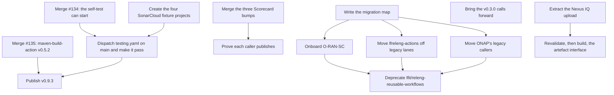

<!--
SPDX-License-Identifier: Apache-2.0
SPDX-FileCopyrightText: 2026 The Linux Foundation
-->

<!-- markdownlint-disable MD013 -->

# Security Workflows: Posture and Remaining Work

Current as of 2026-10-08. The latest release is v0.9.2.

This document states where `security-workflows` stands against
`docs/BRIEF.md`, and what remains before the repository meets its
goals for ONAP, O-RAN-SC and OpenDaylight. It records position, not history:
when the position changes, edit the section that describes it. Git
history records how the repository got here, and the BRIEF records
why the lanes take the shape they do.

## Summary

- **All seven lanes ship**, each with GitHub and, where its Gerrit
  posture allows, Gerrit examples. No issue is open.
- **Adoption is broad but uneven.** 65 repositories outside this
  organisation make 97 calls: ONAP's CLM and Sonar estates, two ONAP
  Scorecard callers, and OpenDaylight's Sonar estate. O-RAN-SC makes
  none. Inside the organisation, `lfreleng-actions/.github` runs
  `package-hardening-audit` on every repository's pull requests, and
  `action-pin-audit` on those that change workflows.
- **Production proves the common paths; the self-test proves nothing
  yet.** Callers routinely exercise Maven, Gradle and build-less CLM,
  Go CLM through `sbom` mode, and Maven and Go Sonar. Every other
  path depends on `testing.yaml`, which has not completed a run in
  its current form: its one dispatch failed at startup, and its Sonar
  legs need four SonarCloud projects that do not exist.
- **A fix reaches a caller when it bumps, and not before.** Scorecard publication
  works from v0.9.2, proven on this repository's self-scan, but no
  external Scorecard caller runs v0.9.2 yet. 14 calls remain on
  v0.3.0.
- **This organisation's own repositories hold most legacy callers.**
  131 of its 142 repositories still call the legacy Scorecard
  workflow, which holds up deprecating
  `lfit/releng-reusable-workflows`.

## Lanes

<!-- markdownlint-disable MD013 -->

| Lane                      | Gerrit posture  | Callers outside the organisation                  | Callers inside                                    | Live-server evidence                                                                                    |
| ------------------------- | --------------- | ------------------------------------------------- | ------------------------------------------------- | ------------------------------------------------------------------------------------------------------- |
| `sonatype-lifecycle`      | Full            | ONAP: 39 repositories, 40 calls                   | none                                              | Production: Maven, Gradle, `none`, Go `sbom`. Unproven, `testing.yaml` legs: Go CLI, Python, submodules |
| `sonarqube-cloud`         | Full            | ONAP: 37 repositories, 39 calls; OpenDaylight: 16 | none                                              | Production: Maven, Go. Unproven, `testing.yaml` legs: `none`, CLI analysis, submodules                  |
| `openssf-scorecard`       | None, by design | ONAP: 2                                           | `.github`; this repository's self-scan            | Self-scan publishes at v0.9.2; no external caller on v0.9.2                                             |
| `package-hardening-audit` | Full            | none                                              | `.github`, on every repository's pull requests    | Runs organisation-wide                                                                                  |
| `action-pin-audit`        | Full            | none                                              | `.github`, on pull requests that change workflows | Runs organisation-wide                                                                                  |
| `codeql`                  | Partial         | none                                              | `test-rust-project`, `rust-crate-publish-action`  | Two internal callers                                                                                    |
| `zizmor`                  | Partial         | none                                              | none                                              | Unproven; `testing.yaml` legs alone                                                                     |

<!-- markdownlint-enable MD013 -->

No production caller sets `submodules`, `prescan_script_path`,
`mvn_pom_file`, `fetch_depth`, `analysis_mode`, `go_scan_target` or
`python_version`. `testing.yaml` is the one route configured to take
those inputs to a live server, and it has not yet done so.

## Verification

### Per-pull-request harness

`tests/workflow-steps.sh` runs through `workflow-tests.yaml` on every
pull request that changes a workflow or a test. It extracts the lanes'
validation and hook steps with `yq` and runs them against generated
inputs, checks the Scorecard lane against the API's publishing rules,
and runs `tests/scan_contents.py`'s offline cases. `main` carries 83
cases. PR #134 adds 29, which check that every `testing.yaml` leg
grants the permissions its lane declares and names its Sonar project.
The harness exercises no build, scan or upload step.

### Credentialled self-test

`testing.yaml` runs when dispatched, one run at a time across all
refs, because every leg writes to a server-side project that all runs
share.

- **It cannot start on `main`.** GitHub checks each called workflow's
  job permissions against the caller's grant when it loads a run, and
  four legs grant less than their lane declares. The one dispatch of
  the current file (run 37701570063) failed at startup with no jobs;
  the file's earlier form last ran on 2026-07-28. PR #134 fixes the
  four legs.
- **Nexus IQ is ready.** All five fixture applications exist in the
  `lfreleng-actions` organisation: `lfreleng-actions-test-go-project`,
  `-test-python-project`, `-test-maven-project`, `-test-node-project`
  and `-test-python-submodules`. None holds a report yet. The CLI scan
  passes no organisation, so it cannot create a missing application.
- **SonarCloud is not ready.** With PR #134 the Sonar legs analyse into
  `lfreleng-actions_test-maven-project`,
  `lfreleng-actions_test-go-project`,
  `lfreleng-actions_test-node-project` and
  `lfreleng-actions_test-python-submodules`. None exists. The
  organisation's two projects are `lfreleng-actions_test-python-project`
  and `lfreleng-actions_lftools-uv`. Creating projects needs the *Create
  Projects* permission in the SonarCloud organisation.
- **Nothing has tested the CI Nexus IQ credential.** Locally, the IQ
  username returns HTTP 401 and the user code authenticates. CI's
  `NEXUS_IQ_USERNAME` matches neither local identity, which suggests a
  separate service account. The first run that starts settles it.

### Scorecard publication

The Scorecard API re-verifies the producing workflow before accepting
a result, and `ossf/scorecard-action` reports a rejection as a warning
and exits 0, so a run's conclusion proves nothing. The test is the
log, which must hold no `Unable to POST`, and the API, which must
return a result whose date and commit match the run.

At v0.9.2 the lane passes that test: this repository's self-scan logs
no rejection, and `api.scorecard.dev` returns a result dated a minute
after its latest run, at that run's commit. Every external Scorecard
caller pins an earlier release and still logs the rejection:

| Caller                     | Pinned | Change moving it to v0.9.2     |
| -------------------------- | ------ | ------------------------------ |
| `lfreleng-actions/.github` | v0.9.0 | `lfreleng-actions/.github#265` |
| `onap/cps`                 | v0.8.0 | Gerrit `cps` 148122            |
| `onap/policy-opa-pdp`      | v0.5.0 | Gerrit `policy/opa-pdp` 148123 |

## Adoption

Counts come from GitHub code search, with every matching workflow file
read and each reusable-workflow `uses:` line resolved to its release.

| Organisation | Lane                 | Repositories | Calls |
| ------------ | -------------------- | ------------ | ----- |
| ONAP         | `sonatype-lifecycle` | 39           | 40    |
| ONAP         | `sonarqube-cloud`    | 37           | 39    |
| ONAP         | `openssf-scorecard`  | 2            | 2     |
| OpenDaylight | `sonarqube-cloud`    | 16           | 16    |
| O-RAN-SC     | none                 | 0            | 0     |

| Pinned release | Calls |
| -------------- | ----- |
| v0.3.0         | 14    |
| v0.5.0         | 4     |
| v0.7.0         | 1     |
| v0.8.0         | 4     |
| v0.9.0         | 31    |
| v0.9.1         | 1     |
| v0.9.2         | 42    |

The 14 calls on v0.3.0 are all ONAP, 13 CLM and one Sonar:
`ccsdk-cds`, `ccsdk-distribution`, `cps-ncmp-dmi-plugin` (both lanes),
`dcaegen2-collectors-hv-ves`, `sdc-sdc-helm-validator`, `sdnc-oam`,
`so-so-admin-cockpit`, `usecase-ui-nlp`, and the five
`so-adapters-*` repositories. They run without every fix since,
including D21's toolchain correction.

### Caller health

Of the 28 ONAP `sonar-master.yaml` callers, 26 have not run yet. Six
callers' latest runs fail:

<!-- markdownlint-disable MD013 -->

| Caller                              | Lane and pin  | Cause                                                                                    | Owner                      |
| ----------------------------------- | ------------- | ---------------------------------------------------------------------------------------- | -------------------------- |
| `onap/so-adapters-so-nssmf-adapter` | CLM, v0.3.0   | Nexus IQ application `onap-so-adapters-so-nssmf-adapter` does not exist                  | Nexus IQ provisioning      |
| `onap/ccsdk-cds`                    | CLM, v0.3.0   | The CLI fails to parse a template `package.json` the build installs under `node_modules` | Scan scope (see decisions) |
| `onap/policy-drools-pdp`            | Sonar, v0.9.2 | `policy-management` unit tests fail                                                      | Project (D12)              |
| `onap/policy-opa-pdp`               | Sonar, v0.5.0 | Go tests fail                                                                            | Project (D12)              |
| `opendaylight/controller`           | Sonar, v0.9.0 | `RaftActorTest` fails                                                                    | Project (D12)              |
| `opendaylight/odlparent`            | Sonar, v0.9.0 | Build errors (`Prefer java.net.URI.toURL()`)                                             | Project, possibly JDK      |

<!-- markdownlint-enable MD013 -->

## Legacy workflows still in use

Deprecating `lfit/releng-reusable-workflows` (BRIEF follow-up 5)
waits on these callers moving:

<!-- markdownlint-disable MD013 -->

| Organisation     | Legacy workflow                    | Callers                                                                 |
| ---------------- | ---------------------------------- | ----------------------------------------------------------------------- |
| lfreleng-actions | `reuse-openssf-scorecard`          | 131 of 142 repositories                                                 |
| lfreleng-actions | `reuse-python-codeql`              | 7 repositories                                                          |
| lfreleng-actions | `reuse-sonatype-lifecycle`         | `http-api-tool-docker`, `lftools-uv`                                    |
| lfreleng-actions | `reuse-sonarqube-cloud`            | `http-api-tool-docker`                                                  |
| ONAP             | `reuse-openssf-scorecard`          | 12 `policy-*` repositories                                              |
| ONAP             | `composed-maven-nexus-iq`          | `ccsdk-sli`                                                             |
| O-RAN-SC         | `reuse-sonatype-lifecycle`         | `o-du-l2`, `smo-o1`                                                     |
| O-RAN-SC         | `reuse-sonarqube-cloud`            | `o-du-l2`                                                               |
| O-RAN-SC         | Jenkins `gerrit-tox-nexus-iq-clm`  | `pti-o2`, `smo-ves`, `ric-plt-xapp-frame-py`                            |

<!-- markdownlint-enable MD013 -->

OpenDaylight calls no legacy security workflow.

## Dependencies

Pins on `main` that trail their latest release:

<!-- markdownlint-disable MD013 -->

| Action                          | Pinned | Latest | Note                                                                                                                        |
| ------------------------------- | ------ | ------ | --------------------------------------------------------------------------------------------------------------------------- |
| `maven-build-action`            | v0.4.3 | v0.5.2 | v0.4.3 builds on Zulu whatever `java_distribution` asks; PR #135                                                            |
| `maven-xml-settings-action`     | v0.1.1 | v0.2.0 | Server credentials become optional                                                                                          |
| `build-metadata-action`         | v0.8.3 | v0.9.0 | Reports generated Java source directories                                                                                   |
| `checkout-gerrit-change-action` | v1.1.0 | v1.1.2 | Gerrit checkout fixes: the change's parent in shallow clones, and submodules that track the change, including ones it drops |
| `go-test-action`                | v0.1.1 | v0.1.2 | Maintenance                                                                                                                 |

<!-- markdownlint-enable MD013 -->

Dependabot proposes each once its seven-day cooldown passes.

## Remaining work

```mermaid
graph TD
    A1["Merge #134: the self-test can start"]
    A2["Create the four SonarCloud fixture projects"]
    A3["Dispatch testing.yaml on main and make it pass"]
    B1["Merge #135: maven-build-action v0.5.2"]
    B2["Publish v0.9.3"]
    C1["Merge the three Scorecard bumps"]
    C2["Prove each caller publishes"]
    D1["Write the migration map"]
    D2["Bring the v0.3.0 calls forward"]
    D3["Onboard O-RAN-SC"]
    D4["Move lfreleng-actions off legacy lanes"]
    D6["Move ONAP's legacy callers"]
    D5["Deprecate lfit/releng-reusable-workflows"]
    E1["Extract the Nexus IQ upload"]
    E2["Revalidate, then build, the artefact interface"]
    A1 --> A3
    A2 --> A3
    B1 --> B2
    A3 --> B2
    C1 --> C2
    D1 --> D3
    D1 --> D4
    D1 --> D6
    D3 --> D5
    D4 --> D5
    D6 --> D5
    E1 --> E2
```

### 1. Make the self-test run end to end

This is the highest priority: until it passes, nobody has observed how
the lanes behave on the paths production does not use.

1. **Merge PR #134**, which grants four legs their lanes' permissions,
   names each Sonar leg's project, and adds harness checks for both.
2. **Create the four SonarCloud projects** listed under Verification,
   public like the existing fixture project. This needs someone with
   *Create Projects* permission in the `lfreleng-actions` SonarCloud
   organisation. Until they exist, the Sonar legs fail on a missing
   project and the rest of the run proceeds.
3. **Dispatch `testing.yaml` on `main` and make it pass.** The first
   run that starts also settles the CI Nexus IQ credential. Triage each
   failure as lane, fixture or provisioning before changing a lane.
4. **Keep it passing**: dispatch before each release, so the released
   tree is a tested one.

### 2. Reach the callers with what shipped

1. **Scorecard.** Merge `lfreleng-actions/.github#265` and Gerrit
   changes `cps` 148122 and `policy/opa-pdp` 148123. Then confirm
   publication for each caller as described under Verification.
2. **Publish v0.9.3** once #135 merges and a dispatch of
   `testing.yaml` on `main` passes, per item 1.4. It changes Maven
   builds in both scan lanes from Zulu to the distribution
   `java_distribution` names, Temurin by default, for every caller that
   takes it; the release notes should say so.
3. **Bring the v0.3.0 calls forward.** All 14 are ONAP, and changes
   there go through Gerrit.
4. **Fix the two provisioning-side caller failures**: create the
   `onap-so-adapters-so-nssmf-adapter` Nexus IQ application, and settle
   `ccsdk-cds`'s scan scope (see Open decisions).

### 3. Roll out

1. **Write the migration map.** BRIEF follow-up 3, and `README.md`
   promises one. Map each `reuse-*` and `composed-*` workflow to its
   lane and inputs, including the BRIEF's dropped inputs and their
   replacements. Every remaining migration below needs it.
2. **Onboard O-RAN-SC.** Its three Python CLM projects are the first
   candidates for `build_type: 'python'`; two resolve under Python 3.11
   alone, so they need `python_version` (D24). 23 O-RAN-SC workflow
   files point `PRE_BUILD_SCRIPT_URL` at `ci-management`'s `master`
   branch, a mutable ref that `prescan_script_path` replaces.
3. **Move this organisation's repositories off the legacy lanes.** At
   131 repositories for Scorecard alone, a coordinated bulk change is
   the practical route.
4. **Move ONAP's remaining legacy callers**: the 12 `policy-*`
   repositories on the legacy Scorecard workflow, and `ccsdk-sli` on
   `composed-maven-nexus-iq`. Like the rest of ONAP, these change
   through Gerrit.
5. **Deprecate `lfit/releng-reusable-workflows`** once the callers in
   the legacy table have moved. Bringing the v0.3.0 calls forward
   (item 2.3) does not gate this: those callers already use the new
   lanes.

### 4. Structural

1. **Extract the Nexus IQ upload.** `sonatype-lifecycle.yaml` is 1,188
   lines with 15 `run:` steps, and the SBOM REST upload is its largest
   block of inline shell. Move the application lookup and `POST` into a
   composite action, following `grype-scan-action`'s `scripts/*.py`
   layout, and move the harness cases that cover those steps with
   them.
2. **Revalidate the build↔scan artefact interface, then build it.**
   The Maven and Gradle build types, and the Sonar lane's Go and `tox`
   types, still build or test the project inside the scan job; the CLM
   lane's Go and Python types resolve its dependencies there, and
   `none` does neither. The interface concerns the build types.
   `java-workflows` now runs tests, SBOM and CBOM inside its build job,
   and offers an opt-in `upload_build_artifacts` that publishes the
   reactor output or the `m2repo` layout. Before building
   `build-artifact-action`, settle whether that artefact can feed the
   CLM lane, whether Sonar (which needs sources, classes and coverage
   reports) needs a packed workspace, and so whether the estate needs
   the whole action or its safe-unpack half alone. If it needs the
   whole action, the design under Design notes stands.
3. **Derive the Sonar project from the scanned repository.** With
   `repository:` set and no properties file, the scan action derives
   the key from `GITHUB_REPOSITORY`, the caller rather than the target.
   No production caller scans another repository, and `testing.yaml`
   names its projects, so this is latent; fix it in the lane or in
   `sonarqube-cloud-scan-action`.
4. **Node.js CLI scanning**: no issue exists. `onap/portal-ng-ui`
   runs the CLM lane with no pre-scan build; file one when a consumer
   needs more.

### 5. Housekeeping

- `test-python-project` and `test-maven-project` declare
  `sonar.projectKey` values (`test-python-project`,
  `test-maven-project`) that SonarCloud does not use for this
  organisation. `testing.yaml` overrides both, so manual scans alone
  read them; correct them to `lfreleng-actions_<repository>`.

## Open decisions

- **Where the Nexus IQ upload lives.** A new
  `nexus-iq-sbom-upload-action` fits the estate's single-responsibility
  pattern and keeps `sonatype-lifecycle-scan-action`'s `iq_*` gating
  inputs honest, since none applies to an asynchronous upload.
  Extending that action gives one Nexus IQ surface instead.
- **CLM scan exclusions.** `ccsdk-cds` fails because the CLI parses
  files the Maven build installs under `node_modules`. Either callers
  narrow `scan_targets`, or the lane gains an exclusion input.
- **`cyclonedx-gomod mod -test` in `sbom` mode.** D25 records that
  `sbom` mode omits the modules that tests alone need, which the CLI
    path includes.
  Changing it alters `policy-opa-pdp`'s results, so it waits on that
  project's agreement.
- **When D25 reopens.** If `sbom-action` gains a `cyclonedx-gomod`
  backend, and not otherwise; it lists one as planned.

## Risks

- **Unproven paths can regress unseen.** A change to a path that no
  production caller sets and no running test exercises breaks nothing
  visible until a caller adopts it.
- **A green run is not a delivered result.** The Scorecard lane
  reported success on every run while publishing nothing. Check each
  lane's output at its destination, not its job conclusion.
- **Pin drift.** A fix reaches a caller when it bumps; the 14 v0.3.0
  calls lag by every release since.
- **v0.9.3 changes the build JDK.** Maven builds move from Zulu to
  Temurin at the same major version. A project sensitive to the
  vendor would see it first in a scan lane.
- **Inline shell keeps growing.** The harness covers the lanes'
  validation and hook steps, not their build, scan or upload steps,
  and none of it reduces their size.
- **Sibling actions are references, not dependencies.** No workflow
  here calls `grype-scan-action`, `sbom-action` or
  `python-sbom-action`; the structural work copies their idioms. Re-read
  their interfaces before that work starts.

## Design notes

### `build-artifact-action` (pending revalidation)

One composite action with `mode: pack | unpack`, built from
`actions-template`, in its own repository.

- **pack:** `paths`, `path_prefix`, a required `artifact-name`,
  `retention-days` (default 1), `fail-on-empty` (default `true`) and
  `overwrite`. Tar-based, so permissions and symlinks survive the
  artefact's zip envelope. Every matched path, and every symlink target
  it resolves through, must sit inside `path_prefix`. Pack always
  leaves out `.git/`, with no input to include it, and the producer's
  checkout must set `persist-credentials: false`: `actions/checkout`
  otherwise keeps its token in `.git/config` until post-job cleanup,
  and a broad `paths` value would package it.
- **unpack:** `artifact-name` and a destination `path`. Entries with
  absolute or parent-traversal paths, and links resolving outside the
  destination, fail the step. Member checks alone do not stop `tar`
  following a link already below the destination, so the extraction
  root must be newly created and empty.
- **Scope:** hand-offs within one run. Pattern-based fan-in is out of
  scope for v0.1, since `download-artifact` keeps the last writer for
  duplicate filenames under `merge-multiple: true`. Docker image
  archives are not a consumer; they belong beside
  `docker-save-images-action`, loaded with `docker load`.
- **Model:** lift `docker-save-images-action` v0.2.0's validation:
  strict booleans, allowlisted artefact names and output paths,
  symlink-aware workspace containment checked before and after
  `mkdir`, refusal to write through symlinks, collision detection on
  slugged filenames, and uploading an explicit list of written paths.

### CLM lane integration

- An optional `artifact_name` input on `sonatype-lifecycle.yaml`, with
  a caller example composing a producer job with the CLM lane.
- The artefact branch skips both checkout paths and restores into a
  fresh, dedicated extraction root, not `path_prefix`, which defaults
  to the workspace root.
- Input checks reject `artifact_name` combined with a non-`none`
  `build_type`. Strict mutual exclusion would break every caller that
  omits `build_type`, since it defaults to `'none'`.
- Land the action before its CLM integration. The CLM job holds Nexus
  IQ credentials and would accept another job's artefact, so a raw
  `tar` extraction there would expose the traversal surface the design
  exists to close. Land the upload extraction first too: both
  restructure the CLM lane's scan steps, and that order reworks the
  lane once.
